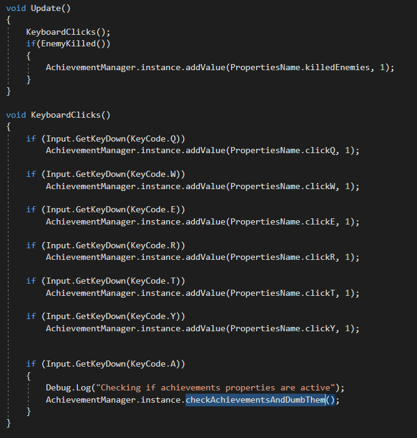

# AchievementsUnity
Simple achievement system based on 2 scriptable objects(property and achievement)  
It's my first "tutorial type" repo so it might not be that great ;) 

## Table of Contents

- [Introduction](#Introduction)
- [Tutorial](#tutorial)
- [Example](#Example)
- [Motivation](#morivation) 

## Introduction
Achievement system to simply add any achievement you like to your Unity project.  
I created this because I like to simplify things in Unity to maximum and with this system, 
creating new achievement is limited only to 3 steps. ( Creating Properties, Achievement, Add them to manager)

## Tutorial
1. First of all define what kind of properties your game will need i.e. "killed enemies" etc. 
  - then you will have to add names of those properties to public ENUM called "PropertiesName"
2. Now when you have done that, you can create SCRIPTABLE OBJECT called "Property" and define:

        PropertiesName _pName;  -> Enum with your properties names
        int mValue;             -> value which is used to count progress of this property
        Activation mActivation; -> condition symbol for your value and ActivationValue i.e( value >= ActivationValue)
        int mActivationValue;   -> goal of your property 
        int mInitialValue;      -> initial value of your property( you want this to be 0, when i.e you count killed enemies)
      
3. When all properties required for achievement are created, we can start to define achievement:
  - Achievement is SCRIPTABLE OBJECT as well, so after you create one add:
  
         string mName;                        -> your Achviev name i.e (Great Hunter)
         PropertiesName[] mRelatedProperties; -> Array of enums we created earlier i.e(killed enemies,deaths)
                                                 those properties are required for this achievement to be unlocked
                                                 
                                                 
4. After all of this is done, just add to game "Achievement manager"(script) and drag all of your properties and achievements to it.
This manager is using SINGLETON so make sure it's always active. Now whenever you need to add values to properties, use this manager.
For example when I kill one enemy i will call 
          
                AchievementManager.instance.addValue(PropertyName.killedEnemies,1) 
                this will add 1 value to killed enemies
  
IN PROJECT IS EXAMPLE OF COUPLE ACHIEVEMENTS AND PROPERTIES TOGETHER WITH  
GAME MANANGER WHERE I CONTROL INPUT TO ACTIVE SPECIFIC PROPERTIES 

## Example
I've created a simple achievement that requires clicks of  "Q W E R T Y" letters, each letter 3 times  
And another with killing enemies, to accomplish is need 20 kills  

BY PRESSING BUTTON "A" ON KEYBOARD I CALL FOR A METHOD WHICH CHECKS IF ANY ACHIEVEMENT IS DONE.  

